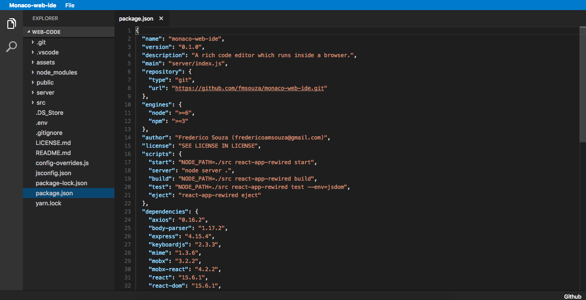

# Monaco Web IDE (alpha)

Monaco Web IDE is a rich code editor which runs inside a browser. It's totally inspired on [Visual Studio Code](https://github.com/Microsoft/vscode), and also uses [Monaco-editor](https://github.com/Microsoft/monaco-editor) as it's core engine for providing a rich experience. It is being developed with Node.js + Express + React.

It was born on a particular necessity of using such software on any kind of platforms, which is not the case of VSCode (only runs in x64 Desktop OSes), by taking inspiration on [this article](https://medium.com/samsung-internet-dev/writing-software-using-a-phone-e71976f1f18d) to produce some alternative kind of software to run in platforms like Android, Raspberry PI, etc.

Currently it still in _alpha stage_, so expect lots and lots of bugs. It is not ready for use yet. It's still more like a _proof of concept_, actually.



## 1. Installation

```bash
$ git clone https://github.com/fmsouza/monaco-web-ide
$ cd monaco-web-ide && npm install
```

## 2. Running

#### `npm run server`

Runs the Express server in http://localhost:8080, which works as a bridge between the web application and the Operating System to allow you to modify your files.

#### `npm start`

Runs the web application in the server address http://localhost:3000

## 3. Contributing

All PR's are welcome.

## 4. Donate

Bitcoin: 3DgNhxV1umz7HCdigvyY18kEsNXW9L4Nx2